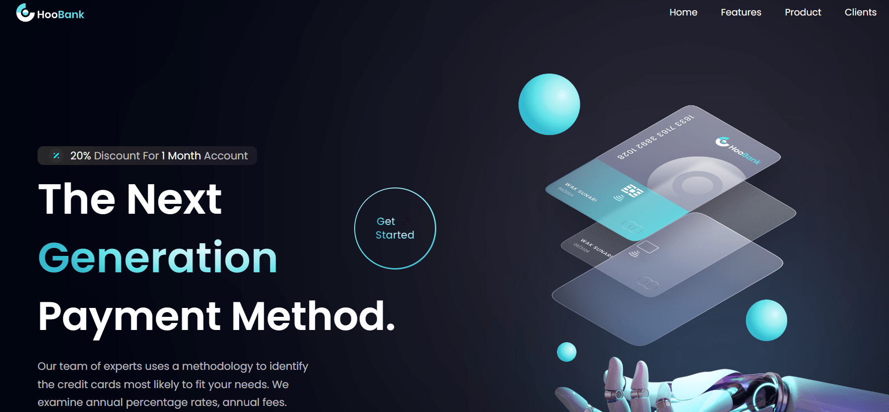

<div align="center">
  <a href="https://bank-modern-cm.netlify.app/" target="_blanck"></a>
  <h3 align="center">HookBank</h3>
</div>

## <br /> 📋 <a name="table">Summary</a>

- ✨ [Introduction](#introduction)
- 🛠 [Technology Used](#tech-stack)
- 🚀 [Launch App](#launch-app)
- 🎨 [Styling](#style)

## <br /> <a name="introduction">✨ Introduction</a>

Web design of an online bank, that propose the next generation payment method. A new way to make the payment an easy, reliable and secure. I use react vite for this project

## <br /> <a name="tech-stack">🛠 Technology Used</a>

- [TailwindCSS](https://tailwindcss.com/docs/installation): is a utility-first CSS framework designed to help you rapidly build modern websites without writing a lot of custom CSS.

- [react-icon](https://www.npmjs.com/package/react-icons)
Include popular icons in your React projects easily with react-icons, which utilizes ES6 imports that allows you to include only the icons that your project is using.
  
## <br /> <a name="launch-app">🚀 Launch App</a>

<br/>**Cloning the Repository**

```bash
git clone {git remote URL}
```

<br/>**installation**

> After cloning the repository, run the command `npm install` to install the project's dependencies.

> Once the dependencies are installed, start the project with the command `npm run dev`.

## <br /> <a name="launch-app">🚀 Styling</a>

Global styling are defined using TailwindCSS in the tailwind.config.js file.

```
  theme: {
    extend: {
      colors: {
        primary: '#00040f',
        secondary: '#00f6ff',
        dimWhite: 'rgba(255,255,255,0.7)',
        dimBlue: 'rgba(9,151,124,0.1)',
        transparent: "transparent",
        lightBlue:"rgb(51, 187, 207)"
      },
      fontFamily:{
        poppins: ["Poppins", "sans-serif"]
      },
    },
    screens: {
      xs: "480px",
      ss: "620px",
      sm: "768px",
      md: "1060px",
      lg: "1200px",
      xl: "1700px",
    }
  },
```

